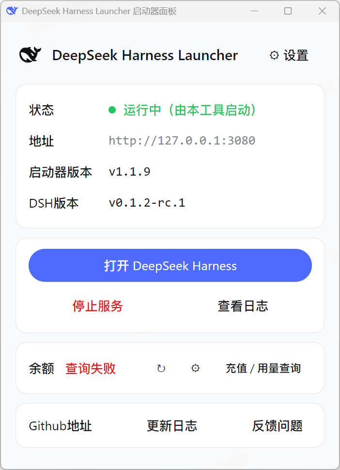
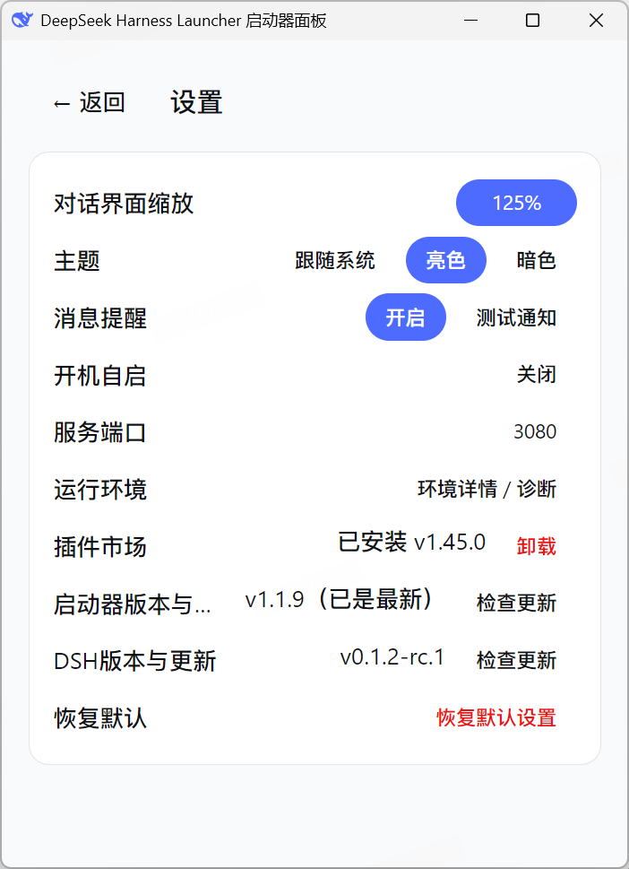
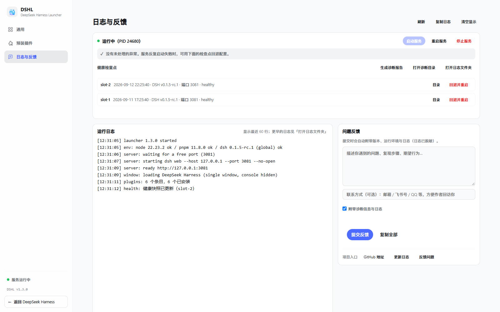

# DeepSeek Harness Launcher（DSHL）—— Windows 托盘启动器 / 看护工具

（本项目完全由DeepSeek Harness搭载Deepseek模型通过Vibe coding得到）

DSHL 是 [DeepSeek Harness](https://www.npmjs.com/package/@deepseek-ai/dsh)（DSH）的 Windows 托盘启动器：系统托盘常驻、一键启动/停止/接管 DSH Web 服务、消息通知（托盘闪烁）、开机自启、运行环境自动检测与一键安装、自动更新。

- **支持平台：Windows 10/11（64 位）**。macOS / Linux 的代码保留在仓库中，但未经过测试，暂不承诺可用。
- 逻辑与行为移植自早期 C# 原型（托盘、QQ/微信式闪烁、接管/启动/停止、通知 dropbox、开机自启、自检）。

## 软件界面



<table>
  <tr>
    <td width="50%"></td>
    <td width="50%"></td>
  </tr>
</table>

## 用户安装与使用

1. 到 [Releases](https://github.com/IMHaoyan/deepseek-harness-launcher/releases) 下载最新 `dshl-<版本>.exe`（NSIS 安装包）。
2. 双击安装（**无需管理员权限、无需预装 Node.js / npm / DSH**），完成后自动启动。
3. 首次运行若检测到运行环境缺失，自动打开"运行环境"页，点击**一键安装缺失环境**即可（自动下载官方 Node.js、安装 DSH、随包插件；全程实时进度 + 日志，失败自动回退国内镜像，可取消/重试）。
4. 环境就绪后自动启动 DSH 服务并弹出 DeepSeek Harness 窗口；此后托盘常驻、开机自启。
5. 卸载：控制面板 → 卸载程序；用户数据保留在 `~/.dsh`（配置、日志、托管运行时、会话数据）。

### 自动更新

- 启动 20 秒后自动静默检查 GitHub Releases 上的新版本，发现即后台下载；
- 发现新版本时：主页面底端"更新日志"右侧出现**绿色 ↑ 圆圈按钮**，点击直达设置页；设置页"检查更新"按钮变为绿色的"更新到 vX"，点击立即安装（下载中显示进度、就绪后可点；退出重启也会自动安装）；
- 下载完成弹托盘通知；设置页可手动"检查更新"并查看当前版本；
- 主页面底端另有"Github地址"（打开仓库主页）与"更新日志"（打开 Releases 页面）按钮。

## 目录结构

```
dshl/
├── main.js               # 主进程：托盘/闪烁/服务管理/通知/自启/自检/IPC/自动更新接线
├── preload.js            # 渲染进程安全桥（contextIsolation + sandbox）
├── browser-preload.js    # 独立窗口（WebContentsView）预加载桥
├── updater.js            # electron-updater 接入（GitHub Releases）
├── env-detect.js         # 环境探测：Node 运行时 + DSH 四种安装形态 + 通知插件（输出 spawn 计划）
├── env-install.js        # 一键安装引擎：托管 Node（官方发行包）+ DSH（npm 前缀安装）+ 插件拷贝，进度/日志/取消
├── ui-src/               # 面板源码（可编辑）：index.html / styles.css / app.js（含"运行环境"页）
├── wwwroot/              # 组装产物（ui-src 拷贝 + 鲸鱼路径内联），由 build:assets 生成，随仓库提交
├── assets/               # 托盘图标（ico 等）+ plugins/dsh-notify.mjs（随包插件）
├── dshl.vbs              # 开发期隐藏窗口启动脚本（可选）
└── tools/
    ├── build-assets.mjs  # 资源生成脚本（需 sharp）
    ├── envcheck.cjs      # 脱离 Electron 的独立环境探测脚本（npm run envcheck，CI/排障用）
    └── install-smoke.cjs # 安装引擎冒烟测试（plugin = 快；dsh = 真实 npm 安装到临时 HOME）
```

## 开发者构建（Windows）

```powershell
cd dshl
npm install            # 安装依赖（Electron + electron-builder + semver + electron-updater）
npm run build:assets   # 首次/修改 ui-src 后需要（sharp 可随 DSH profile 提供：npm i -D sharp）
npm start              # 开发模式运行（或双击 dshl.vbs 隐藏启动）
npm run selftest       # 自检：临时 DSH_HOME + 端口 3999，不影响正在运行的服务
npm run envcheck       # 独立环境探测（退出码 0 就绪 / 1 缺失 / 2 错误）
npm run dist:win       # 打包 NSIS 安装包 → dist/dshl-<版本>.exe（--publish never，不自动上传）
npm run release        # 一键发布：build:assets + dist:win + 创建 GitHub Release 并上传三件套
```

**发布**（`tools/release.mjs`）：前置 = 工作区干净、已 `git push origin main`、安装并登录 GitHub CLI（`winget install GitHub.cli && gh auth login`）。脚本会校验 tag 不存在、产物齐全后 `gh release create v<版本> dshl-<版本>.exe .blockmap latest.yml`；客户端 `electron-updater` 依据 `latest.yml` 自动更新。用法：`npm run release`（说明自动取上一 tag 以来的提交列表），或 `npm run release "v1.0.7 更新内容：\n- 第一条\n- 第二条"`（换行用字面 `\n`，真实换行会被 npm/cmd 批处理截断）。

## 运行环境（自动检测 + 一键安装）

面板"运行环境"页负责 **Node.js 与 DeepSeek Harness 的检测与安装**，首次运行环境未就绪时会自动打开该页引导。

**检测**（`env-detect.js`，优先级第一个可用者胜出）：

- **Node.js**：`nodePath` 配置 → 托管目录（`~/.dsh/dshl-runtime/node/<ver>/`）→ PATH 上的 `node`；版本门槛 = DSH 的 engines（默认 `^22.19.0 || >=24.0.0`），不满足显示"版本过低"并引导托管安装。
- **DSH 四种安装形态分别识别**：
  1. **源码仓库**：`harnessRoot` 配置或默认 `E:\deepseek-harness`，需已构建出 `apps/cli/lib/bin.js`（未构建 → 提示 `pnpm install && pnpm run build`，期间若有其他可用安装则自动回退并在构建完成后自动优先源码版）；
  2. **全局安装**：`npm i -g @deepseek-ai/dsh`（扫常见全局 node_modules 目录）；
  3. **npx 缓存**：`npx @deepseek-ai/dsh web` 装过的（扫 `_npx/*/node_modules/@deepseek-ai/dsh`，取最高版本）；启动器**直接 spawn 缓存里的 JS 入口**，不再调用 npx（避免 hash 目录漂移导致 profile 链接断裂），也不会重复下载；
  4. **托管安装**：一键安装落位到 `~/.dsh/dshl-runtime/dsh/`。
- **通知插件**：`~/.dsh/plugins/dsh-notify/dsh-notify.mjs` 是否存在。

**一键安装**（`env-install.js`，全程零管理员权限、无需预装任何东西）：

- 缺失项 → 面板"一键安装缺失环境"（或单项按钮），顺序 node → dsh → plugin；
- 全程展示：**阶段列表（当前高亮）+ 进度条 + 当前阶段说明 + 实时完整日志**（自动滚动、可关），日志同时落盘 `~/.dsh/dshl-logs/install.log`（1MB 轮转），支持**取消 / 重试**；面板关闭安装不中断，重开自动恢复进度显示；
- Node.js 用官方发行包（`nodejs.org/dist`，自动选择 `nodeMajor`（默认 22）的最新版；下载失败自动回退 npmmirror 镜像；官方 `SHASUMS256.txt` 校验），自带 npm，解压到托管目录；
- DSH 用该 npm 执行 `install --prefix ~/.dsh/dshl-runtime/dsh @deepseek-ai/dsh@<dshVersion>`（registry 失败自动回退 npmmirror），完成后 `--version` 验证；
- 安装完成后自动重新探测并启动服务（复用统一启动入口）；
- 已装用户**绝不重复安装**：按上表识别并分别用对应入口 spawn（源码版 = 仓库 bin.js，全局/npx/托管 = 各自包内 `lib/bin.js`，统一 `web --host 127.0.0.1 --port 3080`）。

排查：`npm run envcheck`（脱离 Electron 的探测脚本，退出码 0/1/2）；安装日志见"运行环境"页或 install.log。

## 配置

`~/.dsh/dshl/config.json`（首次运行自动生成）：

```json
{
  "theme": "light",
  "notify": true,
  "useSystemBrowser": false,
  "autoRestart": true,
  "tabsEnabled": false,
  "port": 0,
  "webWindowWidth": 0,
  "webWindowHeight": 0,
  "webWindowMaximized": false,
  "webWindowX": null,
  "webWindowY": null,
  "harnessRoot": "",
  "nodePath": "",
  "dshVersion": "0.1.0-rc.6",
  "nodeMajor": 22,
  "nodeMirror": "",
  "npmRegistry": "",
  "dshUpdateCheckedAt": 0,
  "panelHideNotified": false
}
```

- **启动器缩放**：面板固定跟随系统缩放，不再提供手动调节（设置页已隐藏该选项）。
- `webZoom` 不入配置：**对话界面缩放**（50–300，默认 = 独立窗口当前缩放），控制独立 WebUI 窗口；窗口内 Ctrl+滚轮按 5% 一格调整并实时同步此设置，调整时窗口中央显示半透明缩放值（末次调整 1 秒后淡出）。
- 启动器面板默认尺寸：**窗口可调整的最小尺寸（480×600）**；手动调整后会记住，设置页"恢复默认设置"可一键清回默认并复位窗口。
- DeepSeek Harness 独立窗口默认尺寸：**高 = 0.8 × 物理分辨率高**（物理 = 逻辑 × 系统缩放），**宽:高 = 3:2**，屏幕居中。
- 窗口定位：DeepSeek Harness 独立窗口**屏幕居中**；启动器面板**右下角紧贴任务栏**（右缘贴屏幕、下缘贴任务栏上沿）。
- **独立窗口几何持久化**：手动调整后的尺寸/位置/最大化状态自动记住（resize/move 防抖落盘），重启后原位恢复；位置不在任何显示器工作区内时自动回退居中（防拔副屏后窗口失踪）；"恢复默认设置"清回默认。
- **服务端口**（设置页，默认 3080）：双击输入新端口（1024–65535）。自己拉起的服务会**立即重启到新端口**并重载所有打开的页面；接管的外部实例不受控制（仅保存，下次由启动器启动时生效）；恢复默认回 3080。
- **问题反馈**（主页"反馈问题"按钮）：弹窗填写问题后一键发送到作者的飞书反馈群（飞书群机器人 webhook，作者即时收到；自动附带版本/环境信息与 dshl/server 日志，同时落盘 `~/.dsh/dshl-logs/feedback/`）。通道地址**随安装包内置**（`assets/feishu-webhook.txt`，.gitignore 排除不进仓库；webhook 仅能向指定群发文本消息，泄露可随时在群设置重置），设置页"反馈通道"可填自定义地址覆盖内置；用户侧无需任何配置与邮箱客户端。
- 设置页"恢复默认设置"按钮：所有选项（缩放/主题/提醒/浏览器方式/自动重启/窗口尺寸/自启）一次恢复默认值。
- **自动重启看护**（设置页开关，默认开）：服务意外退出后自动拉起（10 秒冷却、连续 5 次上限防崩溃死循环），成功后弹"服务已自动重启"通知；接管的外部实例死亡同样触发。
- **日志轮转**：`dshl.log` 与 `server.{out,err}.log` 超过 1MB 自动转存 `.1/.2/.3`，保留最近 3 份。
- **托盘闪烁不自动停**：通知触发的图标闪烁持续到点击托盘/打开窗口为止，不错过提醒。
- `useSystemBrowser`（设置页"使用系统浏览器打开DSH"）：`false`（默认）时"打开 DeepSeek Harness"走托盘自管的独立窗口（复用同一个；点 ✕ 只隐藏到后台继续运行，托盘退出才真正关闭；服务就绪自动刷新错误页）；`true` 时交给系统默认浏览器。
- 独立窗口右上角为 Edge 式**直角窗口按钮**（46px 宽、全高、贴窗缘无圆角、细线 SVG 图标）：**最小化 / 最大化·还原 / 关闭到托盘**（最大化状态图标实时切换）。
- 主题设置（浅色/深色/跟随系统）同时驱动：**启动器面板原生标题栏颜色、独立窗口 tab 栏配色**（经 `nativeTheme.themeSource` 落地，页面内 `prefers-color-scheme` 一并跟随）。
- **"启用标签和内部分屏功能"**（设置页开关，默认关闭）：开启后独立窗口标题栏为完整形态（标签列表 + 新建 ＋、右侧 分屏 / 最小化 / 最大化 / 关闭）；关闭后标题栏只保留 **标题 + 最小化 / 最大化 / 关闭**，标签与分屏按钮及对应快捷键全部禁用（关闭瞬间自动退出分屏并只保留当前标签）。
- 托盘交互：单击图标打开 DeepSeek Harness（独立窗口），右键菜单仅"显示启动器面板 / 打开 DeepSeek Harness / 退出"；启动时**服务运行成功后自动弹出一次** DeepSeek Harness（等价于点击"打开 DeepSeek Harness"按钮），启动器面板不自动打开。
- 独立窗口是 **Edge 式原生分屏**：顶部 tab 栏（高度 42px：38px × 130% × 85% 取整；标签标题字体 12.6px、tab 横向长度最长 243px、直角矩形 Edge 外观；＋ 新建、× 关闭、点击切换、可拖动窗口），**"分屏"按钮位于最右侧（最小化按钮左侧）**，开启左右双视图（分隔条可拖拽，20%–80%；**单标签分屏自动复制当前页为右分屏，关闭任一侧即退出分屏并铺满**）；页面视图用 **WebContentsView 原生挂载**（与 Edge 同源的合成器方案，切换/分屏零闪烁，新标签后台预热无白屏）；快捷键 **Ctrl+\\** 分屏、**Ctrl+Del** 关闭聚焦侧、**Shift+Alt+S** 交换左右；**聚焦单个分屏时该侧右上角浮出 Edge 式控件**：✕ 关闭此分屏、⋯ 菜单（切换左右分屏 / 在新标签页中打开此网页——复制当前 URL 到新标签后关闭原分屏）；Ctrl+滚轮缩放对所有视图同步生效并显示中央浮层。
- `harnessRoot`：DSH 仓库根目录（源码版）。缺省 Windows 用 `E:\deepseek-harness`。
- `nodePath`：Node 可执行文件绝对路径（自动探测失败时手动指定）。
- `dshVersion`：一键安装锁定的 DSH 版本（默认 `0.1.0-rc.6`；改 `latest` 可装最新）。DSH 自动更新成功后会自动置为 `latest`。
- `nodeMajor`：托管 Node 的主版本号（默认 22，即自动装 22.x LTS 最新版）。
- `nodeMirror`：Node 发行包下载源覆盖（默认空 = nodejs.org 官方源，失败自动回退 npmmirror；可填镜像地址）。
- `npmRegistry`：npm 源覆盖（默认空 = npm 官方源，失败自动回退 npmmirror；可填镜像地址）。
- `dshUpdateCheckedAt`：DSH 自动更新上次检查的时间戳（内部记账，自动维护）。
- `panelHideNotified`：关闭启动器面板时"已最小化到托盘"的引导通知是否已提示过（**只弹一次**，之后静默缩到托盘；"恢复默认设置"会复位重新提示）。

## DSH 自动更新

启动器**静默保持 DeepSeek Harness 为最新版**，全程无需用户确认（与启动器自身的"检查更新"相互独立）：

- 启动 20 秒后首次检查，此后每 6 小时尝试一次（**24 小时节流**，`dshUpdateCheckedAt` 落盘防频繁请求 npm）；
- 用 `npm view @deepseek-ai/dsh version` 对比已安装版本（registry 失败自动回退 npmmirror），有新版本则按安装形态自动升级：
  - **托管安装**：复用一键安装引擎重装到最新（`npm install --prefix` 覆盖旧版，进度/日志进安装日志），完成后自动重启服务；
  - **全局安装**：系统 npm 执行 `npm update -g @deepseek-ai/dsh`（registry 回退同上），完成后自动重启服务；
  - **npx 缓存**：`npm exec` 预热新版本进缓存（检测按最高版本选中），完成后自动重启服务；
  - **源码版**：不动开发者仓库，仅记日志；
- 更新成功弹托盘通知"已自动更新到 vX"；更新前会先停掉自己拉起的服务（更新失败自动用旧版拉起，不停摆）；**接管中的外部实例不受控制**，通知中会提示需手动重启；
- 手动安装任务进行中时自动跳过；手动"检查更新"按钮查的仍是启动器自身，与 DSH 无关。

## 与 DSH 的协作

- 服务启动：按环境探测结果 spawn（源码版 = `<harnessRoot>/apps/cli/lib/bin.js`；全局/npx/托管 = 各自包内 `lib/bin.js`），统一参数 `web --host 127.0.0.1 --port <服务端口（默认 3080，设置页可改）>`（隐藏窗口，日志写入 `~/.dsh/dshl-logs/server.{out,err}.log`）。
- 环境未就绪时：不盲 spawn，托盘单击打开面板引导一键安装；自动重启看护同样跳过（重测缓存 30s，用户外部装好后自动就绪）。
- 端口探测 + 接管：端口被占时**先做 HTTP 指纹验证**（根页面含 "DeepSeek Harness" 标题字样）确认是 DSH 才接管（退出时不停止它）；被其他程序占用则**拒绝接管与启动**：自动探测出下一个空闲端口，面板弹"⚠ 服务端口被占用"警示卡，**一键"换到端口 X 并启动"**（也可去设置页手动改端口），绝不误杀。
- 会话通知：复用 `dsh-notify` 插件的 dropbox（`~/.dsh/dshl-logs/notify/*.json`，插件已同步使用 dshl-logs）。
- 托盘自身日志：`~/.dsh/dshl-logs/dshl.log`。

## 维护者：发布新版本

1. 更新 `package.json` 的 `version`（如 `1.0.5`），提交并推送；
2. `npm run dist:win`（构建 NSIS 安装包与更新元数据，产物在 `dist/`）；
3. 创建 GitHub Release（electron-updater 按 `v<版本>` 标签查找）：

```powershell
gh release create v1.0.5 dist/dshl-1.0.5.exe dist/latest.yml dist/dshl-1.0.5.exe.blockmap --title "v1.0.5" --notes "更新说明…"
```

已安装用户下次启动会自动检测到新版本并后台下载，退出重启即完成升级。

> 更新机制依赖 `build.publish`（provider=github）生成的 `app-update.yml`（已随安装包内置）与 Release 中的 `latest.yml`；两者版本一致才能生效。

## 已知限制

- Windows 开发模式（`npm start`）通知来源显示为 "Electron"；安装版显示产品名。
- 托盘 / 窗口任务栏 / 打包 exe 图标统一为**彩色 DeepSeek 鲸鱼**（`assets/deepseek-color.svg`，品牌蓝 #4D6BFE，由 `build:assets` 生成各尺寸），深浅色主题下都清晰，不再做黑白切换。
- 安装包**未做代码签名**：Windows SmartScreen 可能提示"未知发布者"，点"更多信息 → 仍要运行"即可；正式对外分发建议配置代码签名证书（`build.win.certificateFile`）。
- 首次切换到 Electron 版时，设置（缩放/主题/提醒）需重新点一次；旧 C# 版的"启动"文件夹自启快捷方式会被自动清除。
- 随包插件 `assets/plugins/dsh-notify.mjs` 由 DSH 插件生态提供，与启动器一并分发。

## 许可证

[MIT](./LICENSE)
