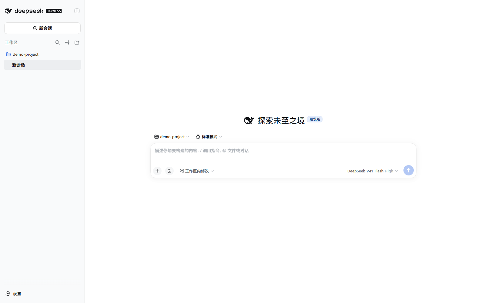

# DeepSeek Harness Launcher（DSHL）

[DeepSeek Harness](https://www.npmjs.com/package/@deepseek-ai/dsh)（DSH）的 Windows 托盘启动器：常驻托盘，负责 DSH Web 服务的启停与看护、运行环境一键安装、预装插件管理、消息通知与自动更新。

支持 **Windows 10/11（64 位）**。macOS / Linux 的代码保留在仓库中，但未测试，暂不承诺可用。

> 本项目完全由 DeepSeek Harness 搭载 DeepSeek 模型通过 Vibe coding 得到。

## 截图

<table>
  <tr>
    <td width="50%"></td>
    <td width="50%"></td>
  </tr>
  <tr>
    <td width="50%"></td>
    <td width="50%"></td>
  </tr>
</table>

## 安装与使用

1. 从 [Releases](https://github.com/IMHaoyan/deepseek-harness-launcher/releases) 下载最新 `dshl-<版本>.exe` 并安装（启动器自身免管理员权限，**无需预装 Node.js / npm / pnpm / DSH**）。
2. 首次启动会立即打开唯一窗口并显示「首次设置」控制台；若运行环境缺失，点击**一键安装缺失环境**即可（Node.js 用官方 `.msi` 安装，会弹**一次管理员授权**；被策略禁止或拒绝授权时自动回退用户级安装，全程进度与日志，失败自动回退国内镜像）。
3. 环境就绪后自动启动服务并进入 DeepSeek Harness 页面；标题栏右侧「控制台」按钮可在同一窗口内打开/关闭 DSHL 控制台，DSH 会话保持存活。此后托盘常驻、开机自启。
4. 卸载：控制面板 → 卸载程序。用户数据保留在 `~/.dsh`（配置、日志、会话数据）。

安装包未做代码签名，SmartScreen 提示「未知发布者」时选择**更多信息 → 仍要运行**。

## 功能

### 单窗口与控制台

- 应用只有一个窗口 —— DeepSeek Harness 独立窗口本身。标题栏右侧「控制台」按钮在同一窗口内打开/关闭宽屏 DSHL 控制台，切换时 DSH 页面保持存活：不重载、不丢会话、不丢滚动位置与输入。
- 控制台左侧固定三项导航：**通用 / 预装插件 / 日志与反馈**，底部常驻服务状态、启动器版本与「返回 DeepSeek Harness」。
- 窗口低于约 960px 时侧栏收成图标栏、内容改单列；低于约 720px 时导航转为顶部横排。

### 通用（原「概览」+「设置」）

- **状态卡**：状态（运行中 / 正在启动 / 正在停止 / 服务正在自动重启 / 已停止 + 服务来源）、地址、启动器版本、DSH 版本；两个版本都可就地「检查更新」。
- **主操作**：打开 DeepSeek Harness；启动 / 重启 DSH（重启 = 停止 → 启动 → 刷新独立窗口）；查看日志。
- **稳定性提示**：上次未正常退出或已自动回退配置时，出现「打开恢复 / 导出诊断 / 知道了」。
- **警示卡**：运行环境缺失时一键安装；端口被占用时给出空闲端口一键切换或直接改端口。
- **偏好设置**分两组：*界面与使用*（控制台缩放、对话界面缩放、主题、消息提醒、三类提醒开关、开机自启）与 *服务与更新*（服务端口、运行环境、**DSH 更新渠道**、**启动器更新渠道**、恢复默认设置）。

### 服务管理

- 托盘一键启动 / 停止 / 打开 DSH，接管已在运行的服务；退出启动器时只停止自己拉起或已认领看护的服务，外部实例保持不动。
- 端口被占用时先做 HTTP 指纹校验：确认是 DSH 才接管，否则拒绝启动并推荐空闲端口，绝不误杀。
- 服务意外退出自动重启（10 秒冷却，10 分钟内最多 5 次）；服务反复启动失败时自动回退到上一个正常配置，仍失败则停止自动恢复并提示。**同一种失败连续复现即判定为确定性失败**（根因在磁盘状态上，重试会逐字复现），直接收敛并交代原因，不再把重试额度烧完。
- **回退覆盖到 DSH 侧的状态**：健康检查点除了启动器自己的配置，还包含 `~/.dsh/settings.yaml`、profile 的 `cordis.patch.yml` 与 `package.json` —— 实测的崩溃循环里坏掉的正是这几个文件，而启动器配置一字未动（只看主配置时"回退"永远不会发生）。`package.json` 回退前先校验：快照声明的插件必须当前都已安装，否则跳过该文件并说明原因，绝不亲手造出「声明了但没装」的启动失败。
- **插件操作串行**：装 / 卸 / 启停与后台自动补装共用一把 profile 写锁。`dsh plugin` 改的是同一棵依赖树，并发改写会让 DSH 读到"声明了某插件但 node_modules 里没有"而启动硬失败 —— 现在第二个操作会拿到一句明确的「另一个插件操作正在进行」而不是继续往下写。
- 启动等待可解释：说明页按真实检查点显示「第 N/M 步」（停止旧服务 → 检查运行环境 → 检查端口占用 → 启动服务进程 → 等待服务就绪 → 载入界面），并在「等待服务就绪」下面**转述服务进程自己刚打印的那条插件日志**（形如 `[usage-billing] aggregated 112 sessions`）——DSH 启动期不打结构化进度，所以这里只转述、不猜内部阶段；没有可展示的输出时如实写「服务进程暂无输出（正在等待端口应答）」，超过 3 秒没有新日志会标注「（N 秒前）」。
- 在 DSH 内点「重启服务」不会被误判成崩溃：先按**启动参数逐字比对**认领后继进程（最多等 20 秒让它绑上端口），状态行区分「由本工具启动 / 服务自重启后已接管 / 接管外部服务」。

### 稳定性与崩溃判定

- **判据是 marker，不是猜测**：每次启动以私有临时文件 + rename 原子发布一份「本次运行」记录（`~/.dsh/dshl-logs/active-run.json`），上次启动留下的那份就是「上次是否受控退出」的唯一证据。清理只认所有者凭证，所以延迟退出的旧进程不会删掉新进程的痕迹。
- **受控退出路径（每条都有对应证据）**：托盘退出 / 更新安装 → `before-quit`；任何走到 `will-quit` 的路径 → 兜底；控制台 Ctrl+C 与 VS Code 停止按钮 → `SIGINT`（Windows 上映射为 SIGINT 而非 SIGTERM）；类 Unix 的 `SIGTERM`；**Windows 关机与注销 → 窗口上的 `session-end`**（Electron 只在 `BaseWindow` / `BrowserWindow` 上派发它，`App` 上没有这个事件 —— 挂错对象等于没挂：每次关机都会在下次启动被判成「上次非受控退出」）；开发者热重启 → `.dev-restart.json` 标记。
- **宁可少报也不误报**：启动时若「本次开机时刻晚于上次运行开始时刻」，判定上次是随系统关机 / 重启结束的，不记崩溃（用 `os.uptime()` 与运行开始时刻交叉验证；开机时刻算得偏早时判否，即维持原判定 —— 绝不把真崩溃说成正常退出）。
- **预期仍会判为非受控退出**：任务管理器「结束进程」（`TerminateProcess`，收不到任何退出事件）与真正的进程崩溃。断电叠加 Windows 快速启动（内核会话被休眠、`uptime` 不重置）时，上面那条兜底可能不成立，此时按原判定处理。
- **子进程日志带时间戳**：`server.err.log` / `server.out.log` 逐行前缀本地时间 + 时区偏移（例 `[2026-09-20T21:20:31.007+08:00] …`），排查「什么时候出的错」不必再靠推断；内存里的失败原因与「当前环节」解析仍用原始行，所以行匹配规则不受影响。
- **接线的机器验证**：`npm run selftest` 会在真实 Electron 里检查运行时接线（例如 `session-end` 是否真的挂在窗口对象上，而不是只看源码里有没有那行字），发布流程把它作为前置检查跑一遍，无 GUI 环境可用 `DSHL_SKIP_SELFTEST=1` 跳过（会留一条显式警告）。

### 运行环境

入口：**通用 → 服务与更新 → 运行环境**（状态卡下的「查看详情（高级）」也直达这里）。

- 自动识别 Node.js、pnpm 与 DSH 的四种安装形态（源码 / 全局 npm / 托管 / npx），缺失或版本过低时引导一键安装。
- 一键安装使用**官方 Node.js 安装包（.msi）**：与在 [nodejs.org](https://nodejs.org/en/download) 下载安装完全一致 —— 落位 `C:\Program Files\nodejs`、注册进「应用和功能」（可修复/卸载）、写入机器 PATH，并带上官方安装器那份 `npmrc`（全局包落在 `%APPDATA%\npm`）。安装包内置、校验 SHA256（失败回退镜像），运行时静默执行，只弹一次管理员授权。
- **已装用户不受影响**：只要能复用现有 Node（自装的 MSI、nvm 等版本管理器）就绝不重装；版本管理器在场时也不会去和它争 PATH。
- 若官方安装包用不了（系统策略禁止 MSI、用户拒绝/没有管理员授权），自动回退**用户级安装**（内置的官网 `.zip` 落到 `%LOCALAPPDATA%\Programs\nodejs`，免管理员、免联网），并复刻 MSI 那份 `npmrc` —— 两种方式的 npm 语义一致（全局包同样在 `%APPDATA%\npm`），差别只在落位与「应用和功能」注册。
- **旧布局可一键迁移**：若检测到 Node 是 dshl 早先的用户级安装（全局包也跟着在该目录里），环境页会多出一张「Node.js 安装方式」卡片 —— 点它即安装官方 MSI、把 DSH 装到 `%APPDATA%\npm`，然后**只清理旧目录里 DSH 自己那份**（同目录下用户自己的其他全局包既不迁移也不删除，只在日志里列出来）。需要一次管理员授权。
- pnpm 优先通过 Node 自带 Corepack 对齐到固定版本；没有 Corepack shim 时回退 npm 全局安装，保证 `dsh plugin` / 插件市场可用。
- **全局 npm 根以 npm 自己报的 `prefix` 为准**（要装、要找、要更新的是同一个目录）：官方 zip 版 Node 没有 MSI 那份 `prefix=%APPDATA%\npm` 覆盖，前缀就是 Node 安装目录 —— 装在那儿也照样找得到；已装的那一份就是更新对象，不会另起第二份。

### 预装插件

> 这一页只放 DSHL 精选的预装插件，**不是插件管理器**。浏览、安装和管理更多插件，请使用 DSH 窗口内的「插件市场」。

- 一张卡片一个插件：名称 + 版本、包名、说明、备注、启用开关、安装 / 重新安装 / 更新到新版本 / 卸载；支持搜索与「已安装 / 未安装」筛选，卡片上直接显示可更新状态。
- **预装排前面**：卡片先列预装集合（插件市场、手机连接，以及注册表里声明 `autoInstall` 的那批），手动安装的排在后面，各组内按注册表顺序 —— 进页面第一眼看到的就是「默认会给我装什么」。分组按注册表声明的意图算，所以卸载/关闭某个预装插件后列表不会跟着重排。
- **真实启停**：关闭只在该 profile 的 patch 层禁用、不卸载，重新打开也不用重装。
- **变更不打断会话**：装 / 卸 / 启停都只改 profile 与 patch 层，控制台顶部常驻「需要重启服务」提示条 —— 装完所有插件点一次「立即重启生效」即可，不必装一个重启一次（DSH 的 client 模块由服务端组装，整页刷新卸载不掉已注册的 UI 入口，所以启停也走重启）。
- **一键安装所有预装插件**：依次补齐本页所有尚未安装的预装插件（插件市场、手机连接与各 npm 推荐插件）；已安装的不动，不做静默升级。
- **不靠关闭策略换成功率**：装 / 卸默认按 pnpm 自己的策略跑 —— 这样 pnpm 会把点名安装的新鲜版本写进 profile 的 `minimumReleaseAgeExclude`，锁文件保持合规，DSH 内置市场、终端里的 pnpm、IDE 都不会被这次安装连坐；只有真的被「24h 新版本观察期」整体拒绝时，才用 `--config.minimumReleaseAge=0` 一次性放行重试一次（这次重试不写放行记录，所以只能当兜底）。注意 pnpm 11.8 的 **`remove` 路径**缺观察期处理器：只要树里存在新鲜条目就直接硬失败（`ERR_PNPM_RESOLUTION_POLICY_VIOLATIONS_UNHANDLED`，而且**不告诉你是哪个包**），同一棵树上的 `add` 却会自愈 —— 它同样算「被观察期拒绝」，走上面这条一次性放行即可卸掉。
- **失败按原因归类**：一批插件同一原因失败时（观察期拒绝整份锁文件、`node_modules` 被别的进程占用、npm 源限流 429、pnpm 未就绪），插件页只给**一条**解释 + 一次「重试失败的插件」，卡片上仍保留各自的错误原文；能算出自愈时刻的按本地时间写出来（观察期 = 最晚的发布时间 + 24h），不写「稍后再试」这类没法验证的话。靠在观察期上一次性放行装好时只留一句概览行后缀（全文在 tooltip），不占版面。
- **默认代装**：插件市场（`dshmarket`）、手机连接（DSH Bridge Next，随安装包分发，入口在 DSH 设置页「手机连接」分区）默认开启；用量与计费（`@kenz1117/dsh-ui-usage-billing`）、技能管理（`@michengai/dsh-skills-manager`）、对话回退（`dsh-rewind-plugin`）在首次运行或升级后自动补装一次 —— 用户手动卸载过就不再装回，手动装回后恢复自动维护。**以下保持手动安装**（卡片标「手动安装」，仍可一键装）：增强侧边栏（`dsh-better-sidebar`）、划线提问（`dsh-sidebar-qa`）、Codex 风格界面（`@michengai/dsh-codex-ui`）、会话导入（`dsh-chat-import`）。划线提问依赖增强侧边栏（前者未装时它只是不显示入口，不会报错）。
- **已停用并自动卸载**：会话归档（`@michengai/dsh-archive-manager`）与 MCP Lens（`dsh-mcp-lens`）已从预装集合移除，插件页不再有这两张卡片。老用户升级到本版本后，启动器会在服务就绪时把它们从 profile 里真正卸载（`RETIRED_NPM_PLUGINS` + `maybeRemoveRetiredPlugins`）：每个启动器版本最多清理一次，卸完重启一次服务生效，失败只记日志、下次启动再补；没有残留的机器只记一次账、不打扰。清理成功时顺带删掉这两个 id 在 DSHL 配置里的「不再自动安装」与卡片备注死键，其它插件不受影响。
- **与 DSH 插件市场同源**：在 DSH 内置市场里的启停会同步到同一份 patch 层；carrier 插件（如 Codex 风格界面）被关闭时会一并恢复它对外层侧栏 / 设置行的覆盖，不会留下「侧栏消失」的状态。

### 更新

- **启动器自身**：静默检查 GitHub Releases，后台下载，退出重启自动安装。**更新渠道可切**（通用 → 服务与更新 → 启动器更新渠道）：`latest`（默认）只收正式版；`alpha` 跟随预发布版，能提前拿到新功能，且因为 GitHub provider 会回落到 `latest.yml`，选 alpha 的机器同样不会漏掉正式版。切回 `latest` 不会降级——已装的 alpha 比正式版新时保持不动，等下一个正式版即可。切换后立即按新渠道重新检查，并作废已下载的旧渠道安装包（避免「显示更新到 vX、装的却是另一个渠道」）。
- **DSH**：静默检测更新（启动后一次 + 按渠道周期：`latest` 每 6 小时、`alpha` 每小时；渠道可选 `latest` / `alpha`，默认 `latest`），升级需点右上角「有更新」或控制台「立即更新」；发现新版时会先在后台把整棵树预装好（约 40s 的解包落盘挪到这一步，用户无感），点击更新只做同卷目录改名 + 重启服务（实测约 15 秒）；没预装就绪时退回完整 npm 安装（实测约 1 分钟）。更新前先停服务，更新后重启并强制重载页面，避免旧进程与新文件混用导致白屏。新版启动失败或版本不符时自动回滚到旧版（预装的旧树还在，改名即可退回）。

### 通知与反馈

- **通知**：DSH 完成 / 提问时托盘闪烁提醒，点击直达对话。**闪烁表示「未读」，判据是窗口有没有焦点**：切到 DSH 窗口（alt-tab / 点任务栏 / 点窗口本身）、打开控制台或更新窗口、点托盘图标，都会立刻停止闪烁；窗口开着但被别的程序盖住或最小化时照常闪（你看不见它，提醒仍该起作用）。系统通知与闪烁是两条通道 —— 通知不看焦点，服务异常这类事该说就说。三类提醒（服务异常 / 服务恢复 / 更新提醒）可分别开关，关闭只影响系统通知，日志仍逐条记录；同一版本的更新提醒只弹一次。**服务启动失败 / 意外退出 / 自动恢复停止的通知里会带上原因**（从服务进程的输出里提取并脱敏），不必先学会"打开控制台看日志"才知道出了什么事。
- **问题反馈**：控制台内填写后一键发送给作者，自动附带版本、运行环境与日志（日志已脱敏）。
- **日志与反馈页**：服务状态与启停、3 个健康检查点（一行一个，可一键回退配置 —— 回退前先把当前配置备份为 `.broken-*` 文件）、运行日志（可切换 **启动器 / 服务错误 / 服务输出** 三个来源；服务起不来时原因在「服务错误」里，有异常时页面顶部直接给出那一句原因并可一键跳转）、生成诊断报告与打开诊断目录；无异常时只占一行「✓ 没有未处理的异常」。

## 开发者

```powershell
npm install            # 安装依赖
npm run build:assets   # 首次或修改 ui-src 后生成 wwwroot 产物
npm start              # 开发模式运行（--console 启动后直接打开控制台）
npm run dev            # 热更新：改 ui-src 自动重建并刷新控制台，改主进程文件自动重启
npm test               # 单元测试（node --test，零依赖）
npm run selftest       # 端到端自检（临时 DSH_HOME + 3999 端口，不影响正在运行的服务）
npm run envcheck       # 脱离 Electron 的环境探测（退出码 0 就绪 / 1 缺失 / 2 错误）
npm run dist:win       # 打包 NSIS 安装包 → dist/dshl-<版本>.exe
npm run release        # 构建 + 创建 GitHub Release 并上传产物
```

VS Code 打开仓库即可使用内置的 `.vscode/launch.json`（Ctrl+Shift+D 选择配置后 F5）：F5 运行的是当前 workspace 的源码，不是 `dist` 安装包；开发配置使用独立的 `.dev-user-data`，避免 Electron 单实例锁冲突；`DSH_HOME` 仍指向真实 `~/.dsh`，F5 前建议先托盘退出已安装版，避免两个启动器同时管理同一 DSH 服务。要验证打包产物，请直接运行 `dist\win-unpacked\DeepSeek Harness Launcher.exe` 或安装 `dist\dshl-*.exe`。

调试 UI：控制台内按 **F12** 或右键 →「打开开发者工具」；配合 `npm run dev` 改样式即时生效。详见 `.vscode/launch.json` 注释。

### 目录结构

```
main.js               主进程：托盘、服务生命周期、IPC、更新接线
preload.js            控制台渲染进程桥（contextIsolation + sandbox）
console-surface.js    控制台 WebContentsView 生命周期（唯一窗口内全页覆盖）
browser-preload.js    独立窗口（WebContentsView）桥
env-detect.js         环境探测（Node + pnpm + DSH 安装形态 + 通知插件）
env-install.js        一键安装引擎（Node 发行包 + pnpm + DSH 全局安装）
updater.js            启动器自动更新（electron-updater）
dsh-update.js         DSH 版本检测、更新与回滚

market.js             插件市场（dshmarket 安装 / 卸载）
plugin-switch.js      插件启停（写 profile 的 cordis.patch.yml，不卸载即可关闭）
bridge.js             远程连接（DSH Bridge Next 安装 / 卸载，随包 payload）
service-stop-guard.js 服务停止防重入与看门狗
service-handover.js   DSH 自重启后继的识别与认领判据（纯函数）
notify-policy.js      通知分类开关与"每版本只提醒一次"策略（纯函数）
redact.js             日志 / 反馈 / 诊断统一脱敏
run-guard.js          活跃运行证据（非正常退出检测）
crash-note.js         崩溃提示的展示与"知道了"记账
start-progress.js     启动步骤文案与进度打点
lifecycle.js          生命周期事件日志
health.js             健康快照与崩溃回退
diagnostics.js        诊断报告
ui-src/               控制台源码（index.html / styles.css / console.css / app.js）
wwwroot/              构建产物（由 ui-src 生成，随仓库提交）
assets/               图标；assets/bridge-next 为随包分发的远程连接 payload
docs/                 发布说明规范与截图
tests/                单元测试
tools/                构建、开发、发布与校验脚本
```

### 新增插件

预装插件页由主进程注册表驱动，不要求为每个插件写专用 DOM：

**推荐插件（npm 分发，最常见）**：

1. 在 `main.js` 的 `MANAGED_NPM_PLUGINS` 里补一条描述（`id` / `order` / `npm` 包名 / 名称 / 说明 / 图标 / 分类；要默认代装再加 `autoInstall: true`）；
2. 动作分支不用改：`runManagedPluginAction()` 按 `id` 在注册表里查表，`install` / `uninstall` / `update` / `reinstall` / `enable` / `disable` 全部通用（插件市场与手机连接是另两张固定卡片，见下）；
3. 只加插件条目不需要重建产物（`wwwroot` 由 `ui-src` 生成，注册表在主进程）；改了 `ui-src` 才要执行 `npm run build:assets`。安装、卸载、更新检查、启停开关、状态卡片全部由通用逻辑生成，无需改 `ui-src/app.js`，也不需要新写安装器模块（启停要求 bundle patch 使用标准的 `insert:` 行；若 bundle 还带有对别的插件的 `disabled: true`（carrier），DSHL 会自动写反向覆盖并在关闭时恢复那些行）。

**随启动器分发或需要专用逻辑的插件**：在 `buildPluginCatalog()` 中补一条描述，并在 `runManagedPluginAction()` 中补对应动作分支（如现有的 `dshmarket`、`bridge-next`）。

### 配置

`~/.dsh/dshl/config.json`（首次运行自动生成）。常用字段：

| 字段 | 说明 |
|---|---|
| `theme` | 主题：`light` / `dark` / `system` |
| `port` | 服务端口，`0` = 默认 3080 |
| `dshVersion` | 一键安装锁定的 DSH 版本，默认 `latest` |
| `pnpmVersion` | 安装/对齐的 pnpm 版本，默认 `11.8.0` |
| `nodeMajor` | 安装的 Node 主版本，默认 22 |
| `nodePath` / `harnessRoot` | 手动指定 Node 路径 / DSH 源码仓库根目录 |
| `nodeMirror` / `npmRegistry` | 下载源与 npm 源覆盖（默认镜像优先、失败回退官方） |
| `notifyCategories` | 三类系统通知的开关：`{ service, recovery, update }` |
| `pluginPendingRestart` | 已改但还没重启生效的插件变更（控制台顶部提示条用） |
| `pluginNotes` | 各插件的本地备注 |
| `remoteConnect` | 远程连接开关：`{ enabled, autoEnabledFor, declined }`。默认开启；旧配置无此字段时升级后自动开启并记录到 `autoEnabledFor`；用户手动关闭会置 `declined`，不会被自动开启重新打开 |
| `feedbackWebhook` | 反馈通道覆盖（通道地址随安装包内置） |

其余字段为窗口几何与内部记账，由程序自动维护。

## 维护者：发布新版本

> **发布由维护者决定，不是改动的收尾动作。** 改完代码、跑通测试、提交推送 ≠ 可以发版：
> 只有维护者明确说「发包」时才执行 `npm run release`，且**执行前必须先征求维护者同意** ——
> 发出去的 prerelease 会被所有 alpha 渠道的机器自动更新，撤回成本远高于多问一句。
> 协作者 / 自动化 agent 可以做到「提交并推送」，但**不得自行发布**。

发布说明必须遵守 [`docs/release-notes-style.md`](./docs/release-notes-style.md)：标题为纯版本号，正文按 新增 / 优化 / 调整 / 修复 / 移除 分组，每条一行、动词开头，只写用户可感知的变化。

1. 更新 `package.json` 的 `version`，按规范写好说明，提交并推送；
2. 执行发布（脚本会补上 `## vX.Y.Z — <日期>` 版本头并打印最终说明）：

```powershell
npm run release "**新增**\n- 通用页新增…\n\n**修复**\n- 修复…"
```

前置条件：工作区干净、已 `git push origin main`、已安装并登录 GitHub CLI。

**渠道由版本号决定**（脚本按它选 yml 与 GitHub 发布类型，写错会直接拒绝发布）：

| `package.json` 版本号 | 渠道 | 产物 yml | GitHub Release | 谁会收到 |
|---|---|---|---|---|
| `1.4.5-alpha.1` | `alpha` | `alpha.yml` | prerelease、不占 Latest | 把「启动器更新渠道」选成 alpha 的机器 |
| `1.4.5` | `latest` | `latest.yml` | 正式 Release（占 Latest） | 所有默认（latest 渠道）机器；选 alpha 的也会拿到 |

日常开发**默认发 alpha**：把版本号写成 `x.y.z-alpha.N` 再跑 `npm run release` 即可。正式版（版本号无预发布段）会推给所有机器，所以脚本额外要求显式加 `--stable` 确认一次，避免版本号忘了改成 alpha 就把未验证的构建发出去。历史上的 `-rc.N` 会被 electron-updater 当成「自定义渠道」而忽略（`rc.yml` 不会分发给任何渠道），脚本已停用这种写法。

## 已知限制

- 安装包未做代码签名，SmartScreen 会提示「未知发布者」。
- Windows 开发模式（`npm start`）的通知来源显示为 "Electron"，安装版显示产品名。
- Defender 排除项需一次 UAC 授权；Windows 11 开启「篡改保护」时无法添加（系统限制，仅记录日志）。

## 许可证

[MIT](./LICENSE)